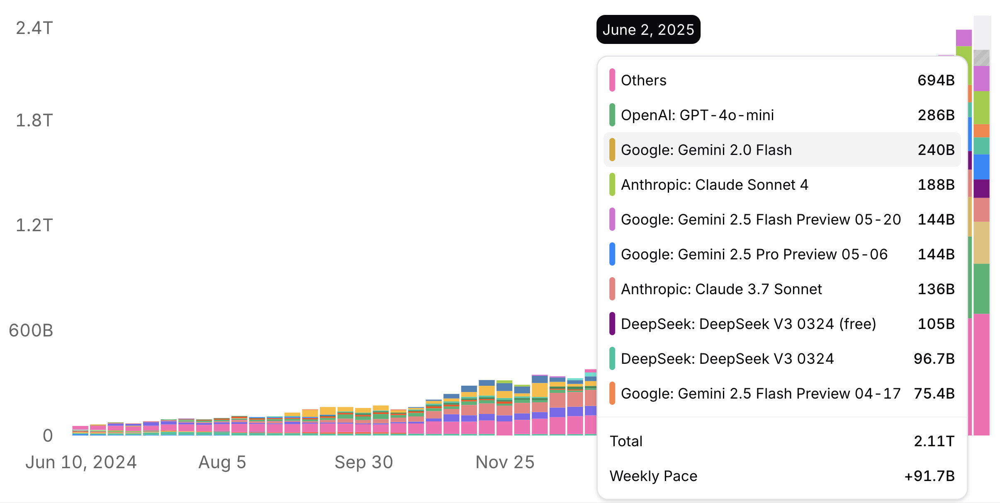

# AI Engineer World's Fair 2025

The AI Engineer World's Fair conference put on by Swyx and Ben Dunphy is the highest signal to noise you'll find in the sea of AI hype we are all drowning in these days. If you're not familiar with Swyx's other publications, also check out [Latent Space](https://www.latent.space/) and [AI News](https://news.smol.ai/).

I'm fortunate to have attended all three of the conferences in San Francisco and the inaugural event in New York City earlier this year in February. Here are some of my favorite talks, and observations from the latest event held last week in San Francisco.

<figure>

  

<figcaption style="text-align: center">Google has 3 models in the top 5 on OpenRouter this week!</figcaption>
</figure>

<!-- more -->

## Highlights

- **Growth**: The event continues to grow. This was the most people and most tracks so far.
- **Google** is finally getting serious about AI. Compared to previous conferences, their models and other projects stand out. It really shows in the [OpenRouter data](https://openrouter.ai/rankings) (see above chart). A year ago, Google wasn't on the chart - this week they have 3 models in the top 5!
- **MCP** > **RAG**: The succession of three letter acronyms. RAG isn't dead, but all the hype now belongs to MCP.
- **Agent Containers**: Solomon Hykes (founder of Docker) open-sourced Dagger's new [container-use](https://github.com/dagger/container-use) project live on stage. It's eerily similar to Jesse Han of MorphLab's [Infinibranch](https://www.morph.so/blog/infinibranch/). Scalable, branchable, and rewindable VMs. Boundary-breaking software like this appears inevitable, or as Jesse says, "Future Bound"
- **Leaderboards**: I now have a better and more complete resource for picking models! [https://artificialanalysis.ai/](https://artificialanalysis.ai/) publishes independent evals of all the models/providers. They don't just measure intelligence, but speed, cost and other dimensions of performance. This is an awesome new resource in my toolbox.

As always, the hallway track and side events are magic. I met so many people. Ran into some old friends. The conversations are fun and inspiring. We discussed topics like what does the future of human art look like? Will programming disappear? How soon? I even got a chance to talk about flow engineering. We both enjoyed getting to chat with someone about a topic that doesn't get as much attention as it should!

## Recommended Talks

You should definitely look through all the sessions on YouTube. All the keynotes are excellent. Here are some of my favorite sessions:

- [2025 in LLMs so far](https://youtu.be/z4zXicOAF28?t=5083) - Simon Willison
- [Containing Agent Chaos](https://youtu.be/U-fMsbY-kHY?t=3392) - Solomon Hykes
- [The infrastructure for the singularity](https://youtu.be/U-fMsbY-kHY?t=4837) - Jesse Han
- [Trends Across the AI Frontier](https://youtu.be/U-fMsbY-kHY?t=26113) - George Cameron
- [#define AI Engineer](https://youtu.be/z4zXicOAF28?t=28290) - swyx and Greg Brockman
- [Designing AI-Intensive Applications](https://youtu.be/z4zXicOAF28?t=1337) - swyx

Can't wait for the next one! Hope to see you there!

!!! tip "Did you find this helpful?"

    📅 I currently offer free consultations. Or if you're more technical, I'd love to schedule a complimentary pair programming session. Feel free to [schedule some time on my calendar](https://cal.com/mattflo/30min).

    🤝 I'd love to connect!

    - 👔 [Connect on LinkedIn](https://www.linkedin.com/in/mattflo/)
    - 🌟 [Follow me on bsky.app](https://bsky.app/profile/mattflo.com)
    - 🐦 [Follow me on X](https://x.com/mattflo)